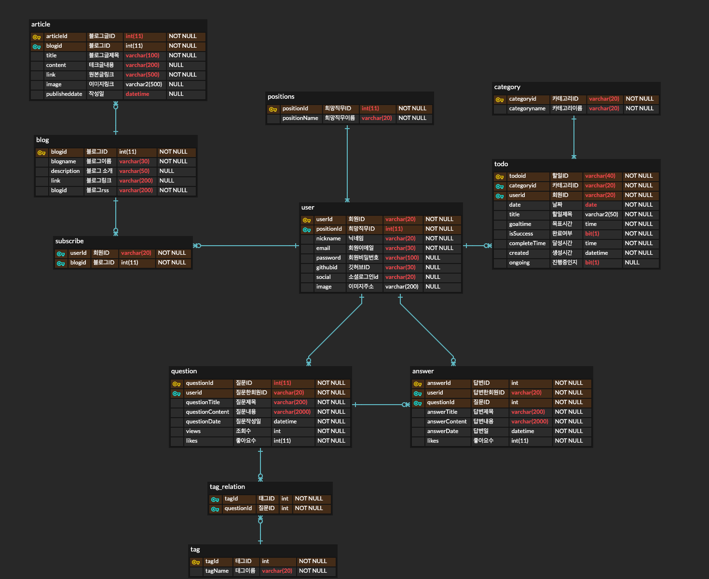

# 🎈 프로젝트 이름 : 오나코 (오늘도 나는 코딩한다)

## 🖌 프로젝트 개요

#### 개발자 취준생의 효율적인 공부를 위해 Todo 항목별 타이머 기능과 기록된 공부시간을 활용한 통계 기능을 제공합니다!

#### 그 뿐만 아니라, 최신 IT 정보를 담은 기술 블로그와 뉴스를 모아서 보여주고 사용자들끼리 질의응답을 할 수 있는 공간도 제공됩니다.

## 핵심 기능

### Todo 타이머 


### 1일 1커밋 알림


### 공부시간 통계


## 👨‍👩‍👦‍👦 팀원소개

### 🧑 고노윤(Frontend)

### 👦 김우현(Frontend)

### 👦 김현홍(Backend)

### 👦 손창환(Backend)

### 🧑 양다연(Frontend)

## 개발 기간

21.07.12 ~ 21.08.20

<br>

## 기획

### 와이어프레임 
[와이어프레임 링크](https://www.figma.com/file/Ybb6iYwJCP9iihZ2bNyI1R/OHNACO?node-id=0%3A1)

### 기능 구조 


### ERD



## <br>

# 개발 규칙

## Git

### Commit Message 규약

- Git Commit Message Template

```bash
S05P12A10100 - [feat] : /FE
# 이슈 번호 - [속성] : 내용 /FE 또는 /BE
##### 제목은 최대 50 글자까지만 입력
##### -> S05P12A10190 - [feat] : 이메일 중복검사/ FE|


######## 본문은 한 줄에 최대 72 글자까지만 입력
############################


######## 꼬리말은 Optional

#   속성 분류
#   feat       : 새로운 기능 추가
#   fix        : 버그 수정
#   refactor   : 코드 리팩토링
#   design     : CSS 등 사용자 UI 디자인 변경
#   ci         : CI 관련 설정 수정에 대한 커밋
#   style      : 코드 포맷팅, 세미콜론 누락, 코드 변경이 없는 경우
#   docs       : 문서 수정
#   test       : 테스트 코드, 리팩토링 테스트 코드 추가
#   build      : 빌드 관련, 패키지 매니저 수정(npm, yarn)
#   chore      : 그 외 자잘한 수정사항
#   rename     : 파일 혹은 폴더명을 수정하거나 옮기는 작업만인 경우
#   remove     : 파일을 삭제하는 작업만 수행한 경우
#   hotfix     : 급하게 치명적인 버그 수정

# ------------------
#     제목 첫 글자를 대문자로 시작
#     제목은 명령문으로 작성
#     제목 끝에 마침표(.) 금지
#     제목과 본문을 한 줄 띄워 분리하기
#     본문은 한 줄당 72자 내로 작성.
#     본문 내용은 양에 구애받지 말고 최대한 상세히 작성
#     본문은 "어떻게" 보다 "무엇을", "왜"를 설명
#     본문에 여러줄의 메시지를 작성할 땐 "-"로 구분
# ------------------

#     꼬리말은 optional이고 이슈 트래커 ID를 작성합니다.
#     꼬리말은 "[유형] [이슈 번호]" 형식으로 사용합니다.
#     여러 개의 이슈 번호를 적을 때는 쉼표로 구분합니다.
#     이슈 트래커 유형은 다음 중 하나를 사용합니다.
#        - Resolves : 이슈를 해결했을 때 사용
#       ex) Resolves S05P12A10190
#        - [이슈 번호] #comment [댓글 내용]
#        : 댓글 남기기

```

```
git config --global commit.template <.gitmessage.txt 경로>
```

<hr>

### Git Flow 규약

Ref : https://techblog.woowahan.com/2553/

#### Branch

**Master - (fix) - Develop - Feature**

- Master : 제품으로 출시될 수 있는 브랜치
- Develop : 다음 출시 버전을 개발하는 브랜치
- Feature : 기능을 개발하는 브랜치
- Fix : 발생한 버그를 수정 하는 브랜치
  <br>

#### Branch Naming 규칙

```
Master, Develop = 수정X
feature/fe(be)/기능명
- feature/fe/login
- feature/be/login
```

<br>

#### feature 브랜치 생성 방법

```
//develop 브랜치에서 생성
$ git checkout -b feature/fe(be)/login develop
```

<br>

#### Merge 규칙

- merge를 하기 전 적어도 1명의 팀원에게 알리고 코드 리뷰가 가능하면 수행 후 merge
- merge 후 branch 삭제
